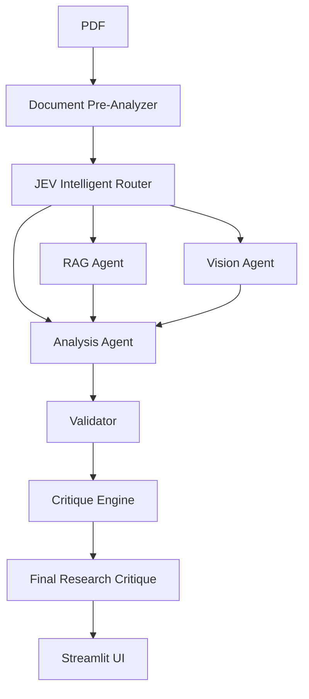

# AI Research Paper Critic

> **AI Research Paper Critic** is a multimodal AI research assistant that analyzes
> academic papers across text, figures, tables, methodology, experiments, claims,
> results, and limitations. It combines adaptive routing, retrieval, visual
> analysis, structured research analysis, and validated critique generation to
> produce an evidence-grounded understanding of a research paper.

> The goal is not only to critique a paper, but to help the reader understand what
> the authors are actually saying in each important part of the paper.

This is a college/research project. It runs as a local Streamlit application on top
of a frozen Python backend, and it has been validated end to end against real
models (JEV routing, OpenAI embeddings, OpenAI multimodal, OpenAI analysis and
synthesis).

## Overview

Reading a research paper is hard because the important material is scattered:

- dense technical language,
- long methodology sections,
- complex experimental setups,
- figures and tables that carry part of the argument,
- claims distributed across several sections,
- evidence that is difficult to connect back to those claims,
- limitations that may be stated explicitly or only implied.

AI Research Paper Critic brings these pieces together. It:

1. understands the paper's structure (sections, figures, tables, equations, references),
2. decides which analysis capabilities are useful for this particular paper,
3. retrieves textual evidence relevant to the research questions,
4. analyses the important visual content,
5. evaluates methodology, experiments, claims, results and limitations,
6. synthesises a grounded critique,
7. explains the findings in simpler language, with page-level evidence.

It is not a chat interface and it does not answer questions in the abstract. It
produces a structured report about one specific paper.

## Why This Project?

The project explores how several AI capabilities can work together on a task that
none of them handles well alone: document structure analysis, adaptive routing,
retrieval-augmented evidence, multimodal visual analysis, structured research
analysis, grounded synthesis, and provenance validation.

The central design idea is simple:

> Different research papers require different types of analysis, so the system does
> not blindly run every capability in the same way.

A paper with almost no figures needs little visual analysis. A heavily theoretical
paper relies more on its text. The router reads the paper first and decides.

## What the System Does

```text
Upload Research Paper
        ↓
Document Understanding
        ↓
Intelligent Routing
        ↓
Textual Evidence ─────┐
        ↓              │
Visual Analysis ──────┤
        ↓              │
Research Analysis ────┘
        ↓
Critique Engine
        ↓
Strict Validation
        ↓
Final Research Critique
```

Every stage is a separate, testable component with a structured output. The
Critique Engine is a synthesis layer only: it reorganises and explains the findings
that the Analysis stage produced, and it is not allowed to introduce new findings of
its own.

## Key Features

- **Document understanding** — local PDF parsing into sections, figures, tables,
  equations, references and content characteristics. No model call.
- **Adaptive routing** — one routing decision per paper decides which agents run and
  at which capability level.
- **Retrieval-augmented evidence** — chunking, embeddings, vector search and
  page-level retrieval of relevant passages.
- **Multimodal visual analysis** — confirmed figures and tables are rendered and
  analysed, with observation, interpretation and uncertainty kept separate.
- **Structured research analysis** — problem, contribution, methodology, data,
  baselines, metrics, results, reproducibility and internal consistency, each tied
  to cited evidence.
- **Claim/evidence matrix** — the paper's main claims with the analysis's verdict on
  how well each is supported.
- **Grounded critique** — a final synthesis that may only use findings supplied by
  the analysis stage.
- **Provenance validation** — invented source IDs, impossible page references,
  numeric scores, rankings and merged limitation categories are detected.
- **Paper-specific explanations** — each section states what *this* paper says, what
  that means in simpler language, and which pages support it.

## Architecture



Responsibilities are deliberately narrow:

- **JEV** routes. It is not a generative model.
- **RAG** retrieves textual evidence.
- **Vision** analyses visual assets.
- **Analysis** evaluates the research itself.
- **Validation** decides whether a generated critique is acceptable.
- **Critique Engine** synthesises; it cannot invent.
- **Streamlit** presents. It makes no model calls.

## How the Pipeline Works

1. **Document Pre-Analyzer** parses the PDF locally and produces a structured
   profile: metadata, page statistics, section hierarchy, confirmed
   figure/table/equation inventory, reference statistics and content
   characteristics.
2. **JEV Router** receives a compact version of that profile and returns a routing
   decision: whether RAG is needed and at which level, whether Vision is needed and
   at which level, and which Analysis level to use — with probabilities and
   confidence values.
3. **RAG Agent** chunks the paper's text, embeds it, and retrieves the passages most
   relevant to the analysis, using the routing-selected level.
4. **Vision Agent** extracts the confirmed visual assets, renders them as images and
   records an observation, an interpretation and any uncertainty for each, with page
   metadata.
5. **Analysis Agent** assembles a bounded evidence context from the profile, the
   retrieved passages and the visual observations, then produces a structured,
   evidence-grounded analysis of the research.
6. **Critique Engine** receives that analysis plus a citation allow-list and produces
   the final critique sections, constrained to the supplied findings.
7. **Validator** checks the result before anything reaches the user.
8. **Streamlit** displays the validated critique and the evidence behind it.

If a stage fails, the pipeline stops and reports a structured failure. No stage is
faked and no other model is silently substituted.

## Core Components

| Component | Location | Responsibility |
|---|---|---|
| Document Pre-Analyzer | `backend/document_pre_analyzer/` | Local PDF parsing and Document Profile construction. No model calls. |
| JEV Router | `backend/jev_router/` | Routing decision only, via the TypeSafe JEV model. |
| RAG Agent | `backend/rag_agent/` | Text extraction, chunking, embeddings, vector store, retrieval. |
| Vision Agent | `backend/vision_agent/` | Visual asset extraction, image preprocessing, multimodal analysis. |
| Analysis Agent | `backend/analysis_agent/` | Bounded evidence context and structured research analysis. |
| Critique Engine | `backend/critique_engine/` | Synthesis context, prompt, generation, validation, provenance. |
| Orchestration | `backend/pipeline.py` | Calls the components in order and passes structured outputs between them. Contains no agent logic. |
| Presentation | `frontend.py` | Streamlit application. |

## Intelligent Routing

Different papers need different analysis. Before any agent runs, JEV decides:

- whether textual retrieval is required,
- the retrieval capability level,
- whether visual analysis is required,
- the visual capability level,
- the analysis capability level.

Levels are abstract **Basic / Medium / Advanced** capability tiers. They are *not*
scientifically calibrated intelligence scores. No overall paper score exists anywhere
in the system.

If the router disables retrieval or visual analysis, that stage is not forced to run.

## Multimodal Evidence Analysis

Text and visuals carry different evidence, so both are handled separately.

- **Textual evidence** comes from retrieval over the paper's own text. Retrieved
  passages are shown with their page numbers, and are linked to the analysis
  findings that cite the same pages.
- **Visual analysis** works on confirmed figure and table assets only. For each asset
  the system records what the image appears to show, what that means, and what is
  uncertain, together with the page it came from.

The visual stage keeps *observation* separate from *interpretation*, and it never
overrides machine-readable table values with guesses read off an image.

## Research Analysis

The analysis stage produces structured findings for each part of the research:

research problem, contribution, methodology, data, baselines, metrics, results,
reproducibility and internal consistency.

It also produces a claim/evidence matrix: each main claim, the evidence that supports
it, the evidence that contradicts it, and the analysis's verdict on whether the claim
is supported, partially supported, unsupported, unclear, or insufficiently evidenced.

Findings that are marked as supported but carry no verifiable reference are downgraded
and the downgrade is recorded rather than silently accepted.

## Grounded Critique

The critique engine is a synthesis layer. It may reorganise, combine, connect,
clarify and summarise the analysis findings, and it rewrites findings in clearer
language when the meaning is preserved.

It may **not** introduce a strength, weakness, limitation, claim, result or
conclusion that the analysis stage did not record. The prompt supplies the allowed
findings as an explicit list, and the validator independently enforces it:

- an invented strength is rejected,
- an invented limitation is rejected,
- a dropped or re-classified claim is rejected,
- a supported section that is not produced is a failure.

If the generated critique does not validate, the pipeline fails and the application
reports that the analysis could not be finalised. It never displays an unvalidated
critique.

## Paper-Specific Explanations

The interface explains *this* paper rather than teaching research terminology. Each
part of the analysis is presented in the same shape:

```text
### Methodology

**What this paper says**   the analysis finding for that part
**Simply put**             the critique's own plain-language explanation
**Evidence**               the pages that support it
```

Both texts come from the backend: the first from the analysis stage, the second
from the critique stage. The frontend adds no rewriting and calls no model. Where the
backend provides too little to explain an aspect, the interface says so rather than
filling the gap.

Technical concepts are kept where they are needed to understand the paper — the
explanation is simplified around the concept, not by deleting it.

## Evidence and Provenance

Every substantive statement in the final report carries the references it came from
(chunk IDs, section IDs, figure and table IDs, page numbers), and those references
are validated against the artifacts that were actually supplied.

- Unknown or mistyped provenance is resolved from real metadata or recorded as
  **unverified** and counted; it is never treated as established fact.
- A page citation that cannot exist (for example page 99 of an 11-page paper) is
  rejected.
- Numeric paper scores, rankings, tiers and grades are rejected anywhere in the
  output, in prose or as field names.
- Author-stated and analyst-identified limitations are kept separate, and a
  limitation filed in the wrong category is relocated to its true category rather
  than merged away.

This is a structural and provenance guarantee. It is **not** a guarantee that every
statement in the paper is factually correct.

## Example Workflow

1. Open the application and upload a research paper (PDF).
2. Press **Read Paper**. The document is parsed locally; the interface shows the
   paper's title, page count and word count.
3. Press **Run Full Analysis**. The six analysis steps appear with live progress:
   document understanding, intelligent routing, textual evidence, visual analysis,
   research analysis and final research critique.
4. Read the **Final Research Critique**: executive summary, overall assessment,
   strengths, limitations, evidence gaps and open research questions, plus the full
   set of critique sections.
5. Read the supporting material below it: what each research dimension says about
   the paper, what the figures and tables show, which passages were retrieved, and
   which analyses were used and why.
6. Every claim in the report can be traced to a page, figure or table.

No analysis begins until the button is pressed, and the results stay available while
the page is interacted with. Uploading a new paper clears the previous result.

## Technology Stack

- **Python**
- **Streamlit** — user interface
- **PyMuPDF** — PDF parsing
- **Docling** — document layout analysis
- **Pillow** — image handling for extracted assets
- **NumPy / Pandas** — vector store and tabular display
- **Pydantic** — structured schemas for every stage
- **OpenAI (client library)** — embeddings, multimodal vision, analysis and synthesis
- **TypeSafe JEV** — routing model
- **HTTPX** — provider HTTP client
- **python-dotenv** — configuration loading
- **Pytest** — offline test suites

Pinned versions are recorded in `requirements.txt`.

## Project Structure

```text
AI Research Paper Critic/
├── frontend.py                       Streamlit application (presentation only)
├── verify_frontend_integration.py    Streamlit AppTest verification script
├── requirements.txt                  Pinned dependencies
├── .env.example                      Configuration template (no secrets)
├── README.md
├── artifacts/                        Locally generated validation artifacts (git-ignored)
├── uploaded_files/                   Uploaded and benchmark PDFs (git-ignored)
└── backend/
    ├── pipeline.py                   Thin end-to-end orchestration
    ├── run_live_validation.py        Real end-to-end validation runner
    ├── tests/                        Orchestration tests
    ├── document_pre_analyzer/        + tests/
    ├── jev_router/                   + tests/
    ├── rag_agent/                    + tests/
    ├── vision_agent/                 + tests/
    ├── analysis_agent/               + tests/
    └── critique_engine/              + tests/
```

Each backend component has its own `tests/` directory. Every test suite is offline
and mocks its provider clients; no test requires an API key.

## Installation

Windows-friendly commands:

```bat
python -m venv .venv
.venv\Scripts\activate
pip install -r requirements.txt
```

## Environment Configuration

Copy the template and fill in your own credentials:

```bat
copy .env.example .env
```

At minimum, two credentials are required:

```dotenv
TYPESAFE_API_KEY=your-typesafe-key
OPENAI_API_KEY=your-openai-key
```

`TYPESAFE_API_KEY` is used by the router; `OPENAI_API_KEY` is used for embeddings,
visual analysis, analysis and critique synthesis. The per-stage variables
(`VISION_API_KEY`, `ANALYSIS_API_KEY`, `CRITIQUE_API_KEY`) are optional: each stage
prefers its own variable and falls back to `OPENAI_API_KEY` when it is empty.

The model identifiers are also configurable and are read from the environment; no
model name is hard-coded in the source. The defaults in `.env.example` are the ones
used during validation:

| Purpose | Variable | Value used |
|---|---|---|
| Routing | `TYPESAFE_JEV_MODEL` | `jev-latest` |
| Embeddings | `OPENAI_EMBEDDING_MODEL` | `text-embedding-3-small` |
| Vision | `VISION_MODEL_BASIC/MEDIUM/ADVANCED` | `gpt-4o-mini` |
| Analysis | `ANALYSIS_MODEL_BASIC/MEDIUM/ADVANCED` | `gpt-4.1-mini` |
| Critique | `CRITIQUE_MODEL_BASIC/MEDIUM/ADVANCED` | `gpt-4.1-mini` |

`.env` is git-ignored and must never be committed.

## Running the Application

```bat
streamlit run frontend.py
```

## Testing

Backend suite (offline; one test is deselected for the reason below):

```bat
pytest backend --deselect backend/rag_agent/tests/test_embeddings.py::TestEmbeddings::test_missing_api_key_raises_error
```

Frontend integration verification:

```bat
python verify_frontend_integration.py
```

Compile check:

```bat
python -m compileall backend frontend.py
```

Verified state of this repository:

- **488 passed, 0 failed, 1 deselected** (backend),
- **32 checks, 0 failed** (Streamlit AppTest walkthrough),
- `compileall` exits 0,
- `streamlit run frontend.py` starts and serves without exceptions.

The deselected test is intentionally not fixed. It passes an empty `api_key`, which
the embeddings provider treats as "not provided" and therefore falls back to
`OPENAI_API_KEY` from the environment. When a real key is present, the test no longer
raises the expected "missing key" error (and would attempt a real embedding request).
It is environment-sensitive by construction, so it is deselected while a live key is
configured. All other tests are fully offline.

## Live End-to-End Validation

The complete pipeline was validated against the benchmark paper using **real API
models** — no mocked responses in the validation run:

| Stage | Result | Detail from the recorded run |
|---|---|---|
| Document Pre-Analyzer | PASS | 11 pages, 4,990 words, 2 figures, 3 tables, 5 equations, 32 references |
| JEV Router | PASS | `jev-latest`; analysis `medium`, RAG `advanced`, Vision `medium`; real probabilities and confidence |
| RAG Agent | PASS | `text-embedding-3-small`; 11 chunks indexed, 8 retrieved |
| Vision Agent | PASS | `gpt-4o-mini`; 5 assets found, 5 analysed, 0 failed |
| Analysis Agent | PASS | `gpt-4.1-mini`; 27 findings, 4 claim/evidence records, 0 unverified references |
| Critique Engine | PASS | `gpt-4.1-mini`; 17 sections |
| Validation | PASS | overall status `completed` |

The run is produced by:

```bat
python -m backend.run_live_validation
```

It writes a local artifact to `artifacts/live_e2e_validation.json` containing the
document summary, routing state, per-stage summaries, the analysis result, the
critique result, the validation status and timings. The artifact contains **no API
keys and no authorization headers**, and it is git-ignored rather than redistributed.

The recorded validation run took approximately 337 seconds end to end on the
machine it was executed on.

## Benchmark

Validation used the established project benchmark paper, "Attention Is All You Need"
(Vaswani et al., 2017), which the document pre-analyser characterises as:

- 11 pages
- approximately 4,990 words
- 2 confirmed figures
- 3 confirmed tables
- 5 confirmed equations
- 32 references
- born-digital document nature

The PDF itself is not redistributed by this repository.

## Limitations

- **Vision asset failures can occur.** A multimodal model occasionally returns
  malformed or non-JSON output for a single asset. The failure is recorded per asset
  and surfaced honestly; it is not hidden or silently retried.
- **LLM output is nondeterministic.** The same paper can produce different wording
  between runs. Validation therefore enforces grounding and structure rather than
  expecting identical text, and a critique that fails validation is reported as a
  failure rather than displayed.
- **Validation is about grounding and structure, not factual correctness.** The system
  guarantees that claims point at real artifacts; it does not verify that every
  statement in the paper is true.
- **One paper per run.** There is no batch mode and no corpus-level processing.
- **No persistent run history.** Results live in the Streamlit session and are
  cleared when a new paper is uploaded.
- **Live API credentials are required** for routing, embeddings, vision, analysis and
  critique. The test suite runs offline with mocked clients.
- **Benchmark scope.** Validation was performed on the established benchmark paper,
  not on a statistically representative sample of research papers.
- **Long runs.** A full analysis takes several minutes because several model stages
  run in sequence.
- **Research prototype.** Single-user, no authentication, no database, no
  multi-tenant isolation. It is not a production-scale platform and does not claim to
  be one.

## Security and API Keys

- Credentials are read from `.env` through environment variables only.
- `.env` is listed in `.gitignore`; `.env.example` contains empty values only.
- API keys are never printed, logged or rendered in the interface.
- Provider errors are masked before they are stored or reported; the application
  shows a friendly message while the detail stays in the server log.
- The validation artifact contains stage statuses and results, never credentials.

## Project Status

The backend is complete, frozen and validated end to end with real models. The
Streamlit application presents the validated critique and the evidence behind it.
Current status:

- all six components implemented and unit tested offline,
- full backend suite passing,
- frontend integration verification passing,
- real end-to-end run completed and recorded,
- frontend displays the validated critique directly from the pipeline.

Not included, by design: batch processing, persistent storage, user accounts,
multi-document comparison, and production deployment.

## License

No license file is currently included in this repository. If the project is
redistributed or published, a license must be added by the project owner.